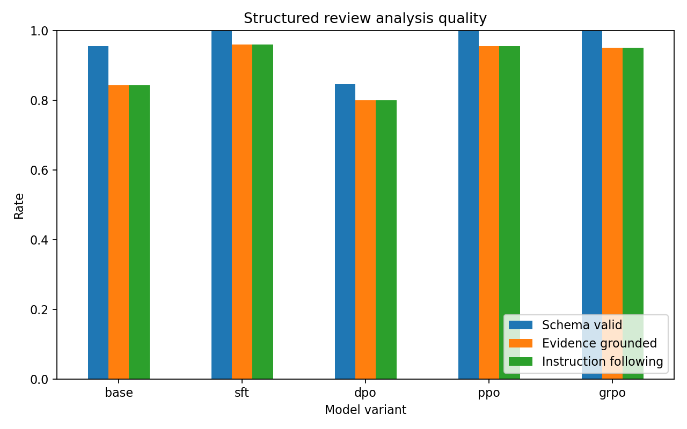

# Amazon Review Alignment Results

## Research question

How do SFT, DPO, PPO, and GRPO affect a small model's structured, evidence-grounded Amazon review analyses under a constrained compute budget?

The comparison uses identical prompts, decoding settings, and held-out reviews. The previous DistilBERT classification result is historical context and is not treated as a directly comparable baseline.

## Local evaluation

| Variant | Examples | Schema valid | Evidence grounded | Word limit | Instruction following |
|---|---:|---:|---:|---:|---:|
| base | 500 | 95.4% | 84.2% | 95.4% | 84.2% |
| sft | 500 | 100.0% | 96.0% | 100.0% | 96.0% |
| dpo | 500 | 84.6% | 80.0% | 84.6% | 80.0% |
| ppo | 500 | 100.0% | 95.4% | 100.0% | 95.4% |
| grpo | 500 | 100.0% | 95.0% | 100.0% | 95.0% |

## Pairwise evaluation

### LLM judge

| Comparison | N | Right-model win rate | 95% CI | Ties |
|---|---:|---:|---:|---:|
| base_vs_sft | 50 | 57.0% | 44.0%–70.0% | 3 |
| sft_vs_dpo | 50 | 75.0% | 64.0%–85.0% | 7 |
| sft_vs_ppo | 50 | 41.0% | 31.0%–52.0% | 19 |
| sft_vs_grpo | 50 | 48.0% | 37.0%–59.0% | 20 |
| dpo_vs_ppo | 50 | 36.0% | 25.0%–48.0% | 10 |
| dpo_vs_grpo | 50 | 40.0% | 28.0%–52.0% | 12 |
| ppo_vs_grpo | 50 | 46.0% | 41.0%–50.0% | 44 |

## Reward Model

| Split | Examples | Preference accuracy | Mean reward margin |
|---|---:|---:|---:|
| ai_validation | 130 | 90.0% | 2.3178 |
| human_held_out | 0 | 0.0% | 0.0000 |

## PPO feasibility metrics

- Episodes: 128
- Unique prompts: 128
- Runtime: 23.5 minutes
- Peak allocated CUDA memory: 13.49 GiB
- Peak reserved CUDA memory: 13.69 GiB
- Reference policy: merged SFT policy with the PPO adapter disabled.
- `objective/kl`: -0.168608
- `objective/rlhf_reward`: 4.414680
- `objective/scores`: 4.406250
- `loss/policy_avg`: 0.006342
- `loss/value_avg`: 5.725081

## GRPO feasibility metrics

- Unique prompts: 128
- Generations per prompt: 4
- Expected completions per epoch: 512
- Runtime: 38.1 minutes
- Peak allocated CUDA memory: 7.71 GiB
- Peak reserved CUDA memory: 8.42 GiB
- Reference policy: merged SFT policy with the GRPO adapter disabled.
- Reward weights: `{"reward_model": 1.0, "schema": 1.0, "evidence": 1.5, "length": 0.25}`
- `completions/mean_length`: 59.750000
- `completions/clipped_ratio`: 0.000000
- `rewards/sft-merged/mean`: -0.444733
- `rewards/sft-merged/std`: 0.320636
- `rewards/schema_reward/mean`: 1.000000
- `rewards/schema_reward/std`: 0.000000
- `rewards/evidence_reward/mean`: 1.000000
- `rewards/evidence_reward/std`: 0.000000
- `rewards/length_reward/mean`: 1.000000
- `rewards/length_reward/std`: 0.000000
- `reward`: 2.305267
- `reward_std`: 0.320636
- `frac_reward_zero_std`: 0.000000
- `kl`: 0.000557
- `entropy`: 0.330971
- `clip_ratio/region_mean`: 0.000000

## Interpretation constraints

- Star ratings are hidden from the teacher and student and are not the main target.
- Teacher-generated preferences can encode teacher bias despite validation.
- Exact substring matching measures evidence traceability, not full causal faithfulness.
- A null or negative DPO result is a valid outcome and must not be reframed as success.
- PPO and GRPO use AI-generated preferences, so they are reported as RLAIF rather than RLHF.
- The PPO policy receives only 256 episodes in the T4 configuration; it is a resource-constrained baseline, not a convergence claim.
- GRPO uses 256 prompts with four sampled completions each; it is a resource-constrained RLAIF baseline, not a convergence claim.
- Full conclusions require the configured cloud training runs and blinded evaluation.
